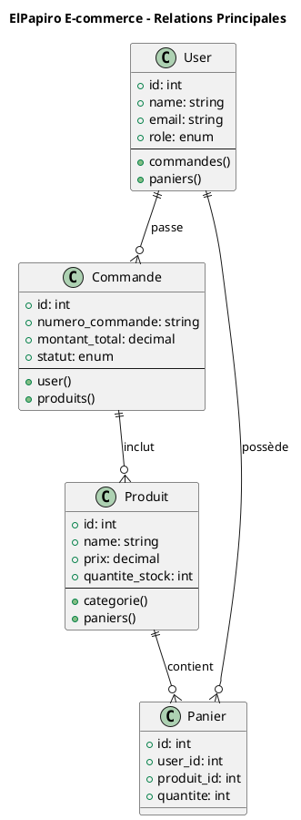

# ⚡ EXEMPLE TEST RAPIDE - Génération Diagramme

## 🧪 **TESTEZ IMMÉDIATEMENT**

Voici un exemple simple pour tester la génération d'images :

### **1. Copiez ce code :**



### **2. Instructions :**
1. **Aller sur** : https://www.plantuml.com/plantuml/uml/
2. **Coller** le code ci-dessus
3. **Cliquer** "Submit"
4. **Voir** le diagramme généré !

### **3. Résultat attendu :**
Vous devriez voir un diagramme de classes coloré avec :
- 4 classes principales
- Relations avec cardinalités
- Attributs et méthodes principales
- Style professionnel PlantUML

---

## 🎯 **SI ÇA MARCHE :**

Félicitations ! Vous pouvez maintenant :
1. **Faire de même** avec vos 8 fichiers .puml complets
2. **Télécharger** chaque image générée
3. **Intégrer** dans votre rapport Word/PDF
4. **Présenter** lors de votre soutenance

---

## 🚀 **NEXT STEPS**

Une fois vos images générées :

1. **Organisez-les** dans votre rapport selon cette structure :
   ```
   4.4 DIAGRAMMES UML COMPLÉMENTAIRES
   ├── 4.4.1 Diagramme de Classes [IMAGE]
   ├── 4.4.2 Séquences Métier [3 IMAGES]  
   ├── 4.4.3 Architecture Composants [IMAGE]
   └── 4.4.4 Comportements Système [3 IMAGES]
   ```

2. **Préparez** vos explications orales pour chaque diagramme

3. **Mettez en avant** la complexité et la qualité de votre modélisation

**🎓 Vous êtes prêt pour une soutenance de qualité professionnelle !**